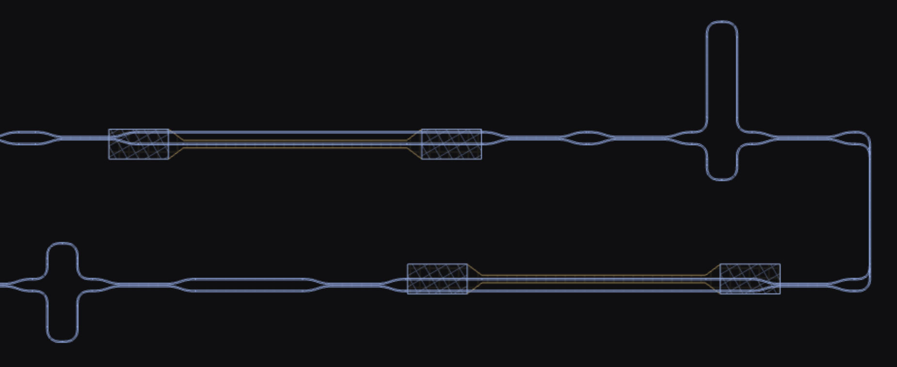

# GDS Lens

[View  GDS Lens on Marketplace](https://marketplace.visualstudio.com/items?itemName=ethml.GDS-Lens)

A VS Code extension that adds a custom editor for `.gds` (GDSII layout)
files: open one and it's parsed and rendered in a WebGL2 canvas, with
support for loading a KLayout `.lyp` file to drive layer colors.

## Features

- Parses and renders GDSII layouts directly in a VS Code webview.
- Optional KLayout `.lyp` file loading for custom layer colors.
- Handles SREF/AREF (including array references), rotation, mirroring, and
  magnification via gdstk's flattening.
- Per-layer visibility toggles and an infill (fill pattern) toggle.
- Measure tool: click two points to read out the distance between them.
- Marker databases: load DRC/LVS violation markers (KLayout `.lyrdb` or
  Calibre DRC ASCII results) as a highlight overlay with a browsable
  category/item panel that zooms to each violation.

## Usage

Open any `.gds` file in VS Code and it opens in the GDS Lens viewer:

- **Pan / zoom** — drag to pan, scroll to zoom.
- **Layers** — toggle individual layer visibility from the panel.
- **Infill** — toggle the hatched layer fill on or off from the panel.
- **Reset View** — refit the layout to the window from the panel.
- **Measure** — enable from the panel (or press `M`), then click two points
  to measure the distance between them (total, Δx, and Δy). Press `Escape`
  to clear the measurement; toggle the mode off to go back to panning.
- **Load KLayout .lyp File** — apply custom layer colors from a `.lyp` file.
- **Load Marker File** — load a DRC/LVS marker database (KLayout `.lyrdb`
  report database or Calibre DRC ASCII results database; the format is
  detected from the file's content, not its extension). Violations draw as a
  red overlay above all layers, and a "Markers" panel lists each category
  (rulecheck) with a visibility toggle and clickable items that zoom the view
  to the violation — press `[` / `]` to step through them. Categories start
  hidden; check the rulechecks you want drawn (clicking an item always shows
  that marker, even if its category is hidden). The panel also has
  an overlay opacity slider and a "Hide empty categories" toggle to hide
  rulechecks with 0 violations. The marker file is
  remembered per GDS file and re-applied when you reopen it; unload it with
  the ✕ on the panel row.
- **GDSLens: Toggle Debug Tools** — command palette entry that shows/hides
  the render stats readout and debug log.

## Release notes

See [`CHANGELOG.md`](CHANGELOG.md).

## Contributing

Build and development instructions are in [`DEVELOPING.md`](DEVELOPING.md).
